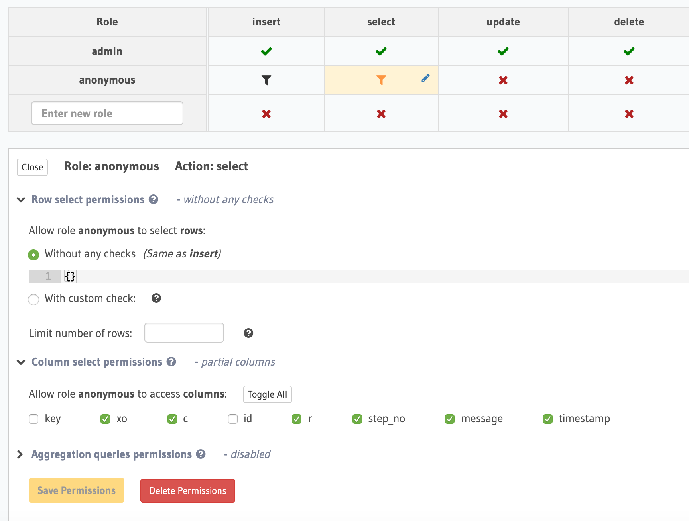

## Run Server 
Run those command bellow

`$ git clone git@github.com:SadiqUltra/tick-tack-toe-backend.git`

`$ cd tick-tack-toe-backend`

`$ docker-compose up -d && docker ps`

Go to hasura console [http://localhost:8080/console/settings/metadata-actions](http://localhost:8080/console/settings/metadata-actions)
then import the [metadata.json](metadata.json) file

From hasura console ([http://localhost:8080/console/data/schema/public/tables/step/permissions](http://localhost:8080/console/data/schema/public/tables/step/permissions))
Change permissions of insert and select of anonymous role according to the two image bellow

Then edit [docker-compose.yaml](docker-compose.yaml)
Change 21 number line to 

`HASURA_GRAPHQL_ENABLE_CONSOLE: "false"`

Again run this command

`$ docker-compose up -d && docker ps`

## Test
Run those command bellow

`$ yarn install`

`$ yarn test`

Frontend repository link: 
https://github.com/SadiqUltra/tick-tack-toe-frontend
